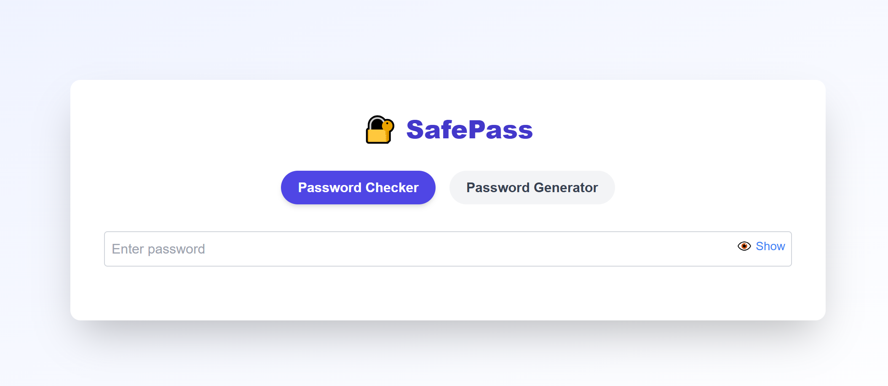

# 🔐 SafePass

**SafePass** is a modern, secure, and fully responsive password utility tool built with **React** and **Tailwind CSS**. It offers real-time password strength checking, breach detection, live suggestions, and advanced password generation—all with dark mode support.

---

## 🚀 Features

### ✅ Password Strength Checker
- Real-time strength meter (Weak / Moderate / Strong)
- Live suggestions to improve password security
- Data breach check using HaveIBeenPwned-compatible API
- Show/Hide password toggle
- Download password as `.txt` file

### 🔁 Password Generator
- Adjustable password length (8 to 64)
- Include/exclude:
  - Uppercase (A–Z)
  - Lowercase (a–z)
  - Numbers (0–9)
  - Special Characters (!@#$%&*)
- One-click password generation
- Copy to clipboard
- Download password as `.txt`

### 🌙 Dark Mode Support
- Fully dark mode-compatible with Tailwind’s `dark:` utilities
- Toggle automatically based on user system preference

### 🧭 Tab-Based UI
- Clean, organized interface with two tabs:
  - `Password Checker`
  - `Password Generator`

---

## 📸 Preview

---

## 🛠️ Tech Stack

- **Frontend**: React, Tailwind CSS
- **Password Check API**: Custom backend (Flask or Node) for breach detection using HaveIBeenPwned-style k-anonymity
- **Clipboard & File APIs**: Native browser support

---

## 🧩 Setup Instructions

1. **Clone the Repo**

    git clone https://github.com/your-username/safepass.git
  
     cd safepass

2. **Install Dependencies**
   
   npm install
   
3. **Run the App**

   npm start
   
Make sure your backend API is running at http://localhost:5000/api/check for breach detection.

## 🧑‍💻 Author

  Ankit Verma
  
 🔗 LinkedIn • GitHub • Twitter

## 🛡 License

This project is open-sourced under the MIT License.
